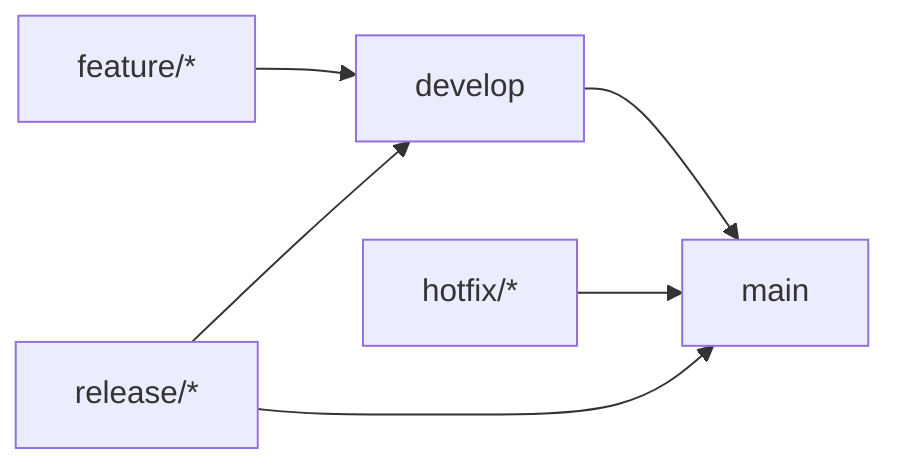

# 🚀 CI/CD Pipeline Documentation

Este documento descreve a configuração moderna de CI/CD implementada para o projeto Monogo, seguindo GitFlow e integração com GitHub Copilot.

## 📋 Visão Geral

O pipeline foi projetado para oferecer:

- ✅ **GitFlow Compliance**: Suporte completo ao fluxo GitFlow
- 🤖 **AI-Powered Reviews**: Integração com GitHub Copilot para revisões automáticas
- 🔒 **Security First**: Múltiplas camadas de scanning de segurança
- 🧪 **Testing Excellence**: Testes automatizados em todos os níveis
- 🚀 **Production Ready**: Deploy zero-downtime com blue-green deployment

## 🌿 GitFlow Workflow

### Branch Strategy



#### Branch Types

- **`feature/*`**: Novas funcionalidades
  - Exemplo: `feature/user-authentication`, `feature/api-endpoints`
  - Trigger: CI básico (lint, test, security scan)

- **`develop`**: Integração e staging
  - Trigger: Deploy automático para staging
  - Testes estendidos + performance tests

- **`main`**: Produção
  - Trigger: Deploy para produção (manual approval)
  - Validações rigorosas + blue-green deployment

- **`hotfix/*`**: Correções urgentes
  - Exemplo: `hotfix/security-patch`, `hotfix/critical-bug`
  - Deploy rápido para produção

### Commit Convention

Siga a convenção **Conventional Commits**:

```bash
feat: add user authentication endpoint
fix: resolve database connection timeout
docs: update API documentation
style: format code according to gofmt
refactor: extract user service logic
test: add integration tests for auth
chore: update dependencies
perf: optimize database queries
ci: update GitHub Actions workflows
build: configure Docker multi-stage build
```

## 🔄 Pipeline Workflows

### 1. Continuous Integration (`ci.yml`)

**Triggers:**
- Push em `feature/*`, `develop`, `main`
- Pull Requests para `develop`, `main`

**Jobs:**
- 🧹 **Lint**: GoLangCI-Lint com configuração rigorosa
- 🧪 **Test**: Testes unitários com PostgreSQL
- 🔒 **Security**: GoSec security scanner
- 🐳 **Docker**: Build test da imagem Docker
- 📝 **Docs**: Verificação de documentação

### 2. PR Validation (`pr-validation.yml`)

**Triggers:**
- Abertura/atualização de PRs
- Comentários em PRs

**Features:**
- 🤖 **AI Code Review**: Análise automática com GitHub Copilot
- 🔄 **GitFlow Validation**: Verificação de naming conventions
- 📋 **PR Readiness**: Checklist automático
- 📊 **Code Metrics**: Complexidade e cobertura

### 3. GitHub Copilot Reviews (`copilot-review.yml`)

**Triggers:**
- Novos PRs
- Comentários com `@copilot`

**AI Capabilities:**
- 🎯 **Smart Analysis**: Detecção de padrões e anti-padrões
- 💬 **Interactive Chat**: Comandos interativos
  - `@copilot explain` - Explicação de código
  - `@copilot security` - Análise de segurança
  - `@copilot performance` - Otimizações
  - `@copilot test` - Estratégias de teste
- 📚 **Auto Documentation**: Geração automática de docs

### 4. Staging Deployment (`develop-staging.yml`)

**Trigger:** Push para `develop`

**Pipeline:**
- 🧪 **Extended Tests**: Testes de integração e E2E
- 🏗️ **Build & Push**: Container registry (GHCR)
- 🔒 **Security Scan**: Trivy container scanning
- 🚀 **Deploy**: Kubernetes staging environment
- 📊 **Performance Tests**: Load testing com k6
- 📢 **Notifications**: Status updates

### 5. Production Deployment (`production.yml`)

**Trigger:** Push para `main` (manual approval)

**Pipeline:**
- 🔒 **Security Gate**: Validações rigorosas
- ✅ **Quality Gate**: Cobertura >80%
- 🏗️ **Production Build**: Multi-arch containers
- 🎯 **Blue-Green Deploy**: Zero-downtime deployment
- 🧪 **Smoke Tests**: Validação pós-deploy
- 📝 **Release Creation**: GitHub releases automáticos
- 🚨 **Rollback**: Capacidade de rollback automático

### 6. Security Scanning (`security-scan.yml`)

**Triggers:**
- Push/PR
- Schedule diário (3h UTC)
- Workflow manual

**Security Tools:**
- 🔍 **GoSec**: Static Application Security Testing
- 🔐 **Nancy/Govulncheck**: Dependency vulnerability scanning
- 🔍 **CodeQL**: Semantic code analysis
- 🐳 **Trivy/Grype**: Container security scanning

## 🤖 GitHub Copilot Integration

### AI-Powered Code Reviews

O Copilot analisa automaticamente:

- **Complexidade**: Funções muito complexas
- **Cobertura**: Baixa cobertura de testes
- **Segurança**: Vulnerabilidades potenciais
- **Performance**: Gargalos de performance
- **Melhores Práticas**: Padrões Go

### Interactive Commands

```bash
# Comandos disponíveis em PRs
@copilot explain the authentication flow
@copilot security review this endpoint
@copilot performance optimize database queries
@copilot test suggest test cases for this function
```

### Auto-Generated Insights

- 📊 **Quality Score**: Pontuação 0-100 baseada em métricas
- 🎯 **Recommendations**: Sugestões específicas de melhoria
- 🚀 **Next Steps**: Ações recomendadas para o PR

## 🔧 Configuration Files

### GitHub Actions

```
.github/
├── workflows/
│   ├── ci.yml                 # Continuous Integration
│   ├── pr-validation.yml      # PR Validation
│   ├── copilot-review.yml     # AI Reviews
│   ├── develop-staging.yml    # Staging Deployment
│   ├── production.yml         # Production Deployment
│   └── security-scan.yml      # Security Scanning
├── ISSUE_TEMPLATE/
│   ├── bug_report.md
│   ├── feature_request.md
│   ├── security_issue.md
│   └── question.md
└── pull_request_template.md
```

### Linting & Quality

- **`.golangci.yml`**: Configuração abrangente do GoLangCI-Lint
- **`Dockerfile`**: Multi-stage build otimizado
- **`.gitlab-ci.yml`**: Referência para equipes GitLab

## 🚀 Getting Started

### 1. Setup Repository

```bash
# Clone o repository
git clone https://github.com/edalferes/monogo.git
cd monogo

# Instalar ferramentas de desenvolvimento
make install-tools

# Executar testes locais
make test

# Lint code
make lint
```

### 2. Development Workflow

```bash
# Criar feature branch
git checkout -b feature/my-awesome-feature

# Fazer mudanças e commit
git add .
git commit -m "feat: add awesome feature"

# Push e criar PR
git push origin feature/my-awesome-feature
```

### 3. CI/CD em Ação

1. **Push** → Triggers CI pipeline
2. **Create PR** → AI review + validations
3. **Merge to develop** → Deploy staging
4. **Merge to main** → Production deployment

## 🔒 Security

### Scanning Layers

1. **SAST**: GoSec para análise estática
2. **Dependency**: Nancy/Govulncheck para dependências
3. **Container**: Trivy/Grype para imagens Docker
4. **Secrets**: Detecção de secrets no código
5. **CodeQL**: Análise semântica avançada

### Security Best Practices

- ✅ Scan automático em todos os PRs
- ✅ Falha na pipeline se vulnerabilidades críticas
- ✅ Scan diário de dependências
- ✅ Container images escaneadas antes do deploy
- ✅ Secrets management via GitHub Secrets

## 📊 Monitoring & Observability

### Metrics Tracked

- **Code Coverage**: >80% requerido para produção
- **Build Times**: Monitoramento de performance
- **Security Score**: Pontuação de segurança
- **Deploy Frequency**: Métricas DORA
- **Lead Time**: Tempo de feature até produção

### Notifications

- 📢 **Slack Integration**: Status updates
- 📧 **Email Alerts**: Falhas críticas
- 🤖 **GitHub Comments**: AI insights
- 📱 **Mobile Push**: Deploy notifications

## 🛠️ Troubleshooting

### Common Issues

**1. Lint Failures**
```bash
# Fix locally
make lint-fix
git commit -m "style: fix linting issues"
```

**2. Test Failures**
```bash
# Run tests locally
make test
make test-integration
```

**3. Security Issues**
```bash
# Check security locally
make security-scan
go list -json -deps ./... | nancy sleuth
```

**4. Build Failures**
```bash
# Test Docker build
docker build -t monogo:test .
```

### Getting Help

- 🐛 **Bugs**: Use bug report template
- ✨ **Features**: Use feature request template
- 🔒 **Security**: Use security issue template
- ❓ **Questions**: Use question template
- 🤖 **AI Help**: Comment `@copilot help` in PRs

## 📚 Additional Resources

- [GitHub Actions Documentation](https://docs.github.com/en/actions)
- [GitHub Copilot](https://github.com/features/copilot)
- [GitFlow Workflow](https://www.atlassian.com/git/tutorials/comparing-workflows/gitflow-workflow)
- [Go Testing Best Practices](https://go.dev/doc/tutorial/add-a-test)
- [Docker Multi-stage Builds](https://docs.docker.com/develop/dev-best-practices/dockerfile_best-practices/)

---

🎉 **Happy Coding!** Este setup oferece uma base sólida para desenvolvimento moderno com Go, garantindo qualidade, segurança e eficiência em todo o ciclo de vida do software.