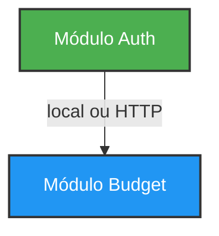
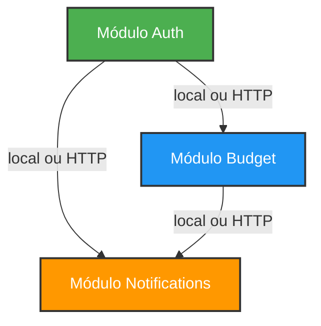

# Grafo de Dependências entre Módulos

Este documento visualiza as relações de dependência entre os módulos do Monetics.

## Grafo Atual de Dependências



**Legenda**:
- 🟢 Verde: Módulos independentes (sem dependências)
- 🔵 Azul: Módulos dependentes

## Dependências Detalhadas

### Módulo Auth

- **Nome**: `auth`
- **Dependências**: Nenhuma
- **Fornece**: UserService, AuthService, validação JWT
- **Status**: ✅ Módulo independente

### Módulo Budget

- **Nome**: `budget`
- **Dependências**: `auth` (obrigatória)
- **Consome**: UserService do Auth
- **Status**: ✅ Módulo dependente

## Fluxo de Inicialização

### Modo Monólito (`--module=all`)

```
┌─────────────────────────────────────────┐
│  Inicialização da Aplicação             │
└─────────────────┬───────────────────────┘
                  │
                  ▼
┌─────────────────────────────────────────┐
│  ModuleRegistry.Initialize()            │
│  ├─ Analisar módulos habilitados         │
│  └─ Resolver ordem de dependências      │
└─────────────────┬───────────────────────┘
                  │
                  ▼
┌─────────────────────────────────────────┐
│  Passo 1: Inicializar Auth              │
│  ├─ Sem dependências, pode iniciar      │
│  ├─ WireUp(group, db, jwtSecret, log)   │
│  ├─ Registrar UserService no container  │
│  └─ Status: ✅ Pronto                    │
└─────────────────┬───────────────────────┘
                  │
                  ▼
┌─────────────────────────────────────────┐
│  Passo 2: Inicializar Budget            │
│  ├─ Dependências: [auth]                │
│  ├─ Verificar: auth inicializado? ✅ SIM │
│  ├─ Recuperar UserService do container  │
│  ├─ WireUp(group, db, userService, log) │
│  └─ Status: ✅ Pronto                    │
└─────────────────┬───────────────────────┘
                  │
                  ▼
┌─────────────────────────────────────────┐
│  Aplicação Pronta                       │
│  └─ Todos os módulos inicializados      │
└─────────────────────────────────────────┘
```

### Modo Microserviços

**Cenário**: Auth e Budget como serviços separados

```
┌───────────────────────────┐     ┌───────────────────────────┐
│   Serviço Auth            │     │   Serviço Budget          │
│   (Porta 8081)            │     │   (Porta 8082)            │
│                           │     │                           │
│  ./bin/monetics           │     │  ./bin/monetics           │
│    --module=auth          │     │    --module=budget        │
│                           │     │                           │
│  ┌─────────────────────┐  │     │  ┌─────────────────────┐  │
│  │ Módulo Auth         │  │     │  │ Módulo Budget       │  │
│  │ - UserService       │  │◄────┼──┼─ Cliente HTTP       │  │
│  │ - Validação JWT     │  │     │  │ - Lógica de Retry   │  │
│  │                     │  │     │  │ - Circuit Breaker   │  │
│  └─────────────────────┘  │     │  └─────────────────────┘  │
│                           │     │                           │
│  Endpoints:               │     │  Endpoints:               │
│  - POST /v1/auth/register │     │  - GET /v1/budget/accounts│
│  - POST /v1/auth/login    │     │  - POST /v1/budget/...    │
│  - GET /v1/auth/users     │     │                           │
│                           │     │  Config:                  │
│                           │     │  AUTH_SERVICE_URL=        │
│                           │     │    http://localhost:8081  │
└───────────────────────────┘     └───────────────────────────┘
```

**Fluxo de Comunicação**:

1. Requisição chega ao serviço Budget
2. Budget precisa validar usuário (do Auth)
3. Budget verifica: Auth está local? ❌ NÃO
4. Budget lê `AUTH_SERVICE_URL` da configuração
5. Budget usa cliente HTTP com retry + circuit breaker
6. Cliente HTTP faz requisição ao serviço Auth (porta 8081)
7. Serviço Auth responde com dados do usuário
8. Budget continua o processamento

## Grafos de Dependência Futuros

### Exemplo: Adicionando Módulo Notifications



**Dependências**:

- Auth: Nenhuma
- Budget: `[auth]`
- Notifications: `[auth, budget]`

**Ordem de Inicialização**:

1. Auth (sem dependências)
2. Budget (depende de Auth)
3. Notifications (depende de Auth e Budget)

## Documentação Relacionada

- [Dependências entre Módulos](./module-dependencies.md)
- [Testando Dependências](./testing-dependencies.md)
- [Padrões de Comunicação](./architecture/communication.md)
